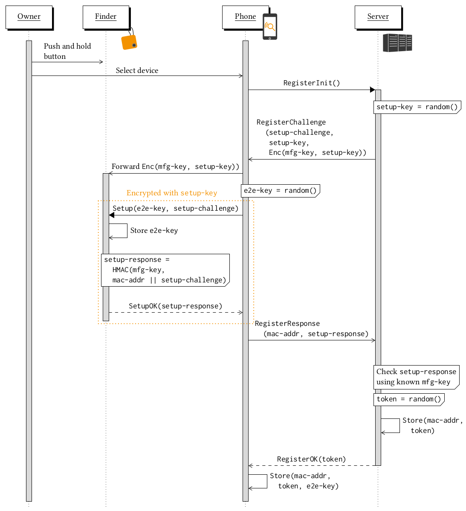
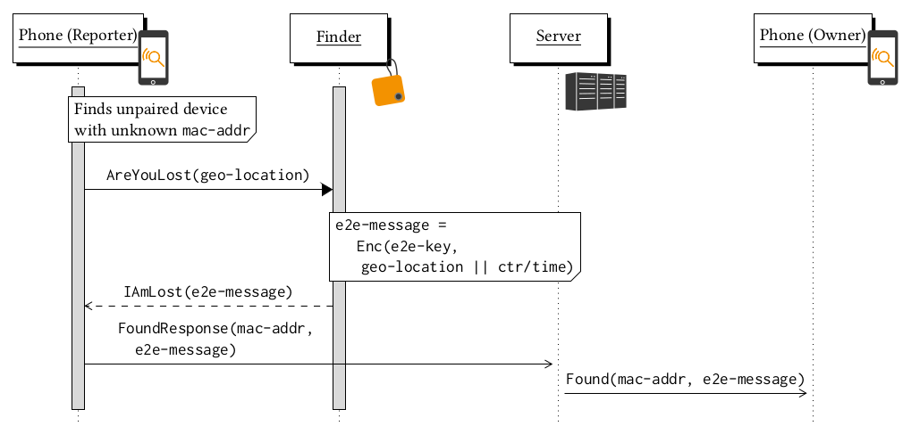

# PrivateFind implementation

In this repository, we publish the implementation of the *PrivateFind* protocol
described in the paper *Lost and Found: Stopping Bluetooth Finders from Leaking Private Information*
published at *WiSec 2020*.

Below follows a short description of the folders contained in this repository.

## Firmware

This folder contains the firmware for the *PrivateFind* devices. The are based on the 
*Nordic Semiconductor nRF52* series Bluetooth SOC, the firmware runs on the integrated
ARM 32-bit Cortex-M4 microcontroller. The firmware is based on the SDK provided by
*Nordic Semiconductor* and requires *IAR Embedded Workbench* and the *IAR MDK for development*.

## Android

The folder `Android` contains an *Android* application to accompany the *PrivateFind* devices. 

It can be compiled and run using *Android Studio*. For the map display to work, a
*Google Maps API* key is required. Please see `Android/app/src/debug/res/values/google_maps_api.xml`
for details. To connect the app to your backend, set the `API_ROOT` constant in
`Android/app/src/main/java/de/seemoo/blefinderapp/Helper.java`.

## Backend

`Backend` contains a *Python/Django* application which provides a server-side backend for the 
*Android* app. All *PrivateFind* devices are registered here via the app. When a device is found,
the app will notify the backend, which in turn sends a push notification to the owner.

Before running the backend, you need to change some settings in
`Backend/finder_backend/finder_backend/settings.py`. Then you can start it using
the following commands in `Backend/finder_backend`:

```
virtualenv -p python3 venv
. venv/bin/activate
pip install -r requirements.txt
python manage.py migrate
python manage.py runserver
```

## Current Protocol Implementation

The current *PrivateFind* implementation slightly differs from the *WiSec* paper.
It ensures anonymity of the reporters and never leaks GPS positions to the server,
however, the server is able to verify finder identities and issues a token bound to these.
While this provides the server infrastructure operator with more control, this comes at
the cost of privacy. Moreover, finder identities are currently not randomized but bound to a MAC address.

As a reference for what is currently implemented, take a look at the following diagrams that describe setup
and reporting of lost finders.





